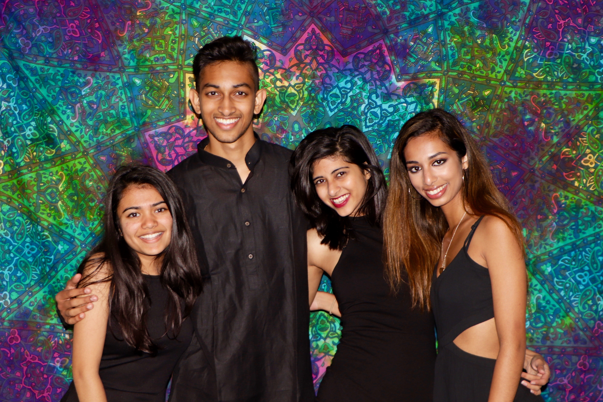
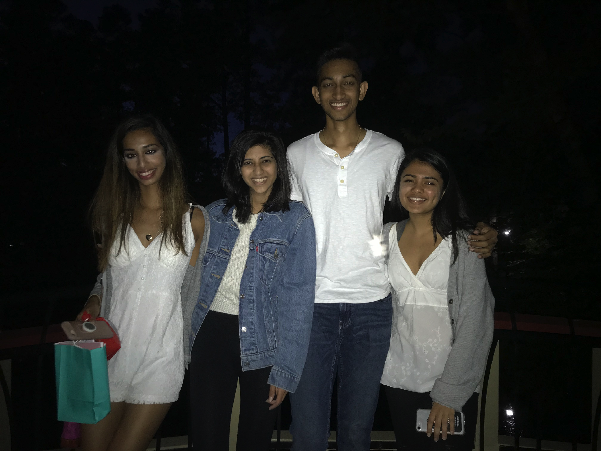
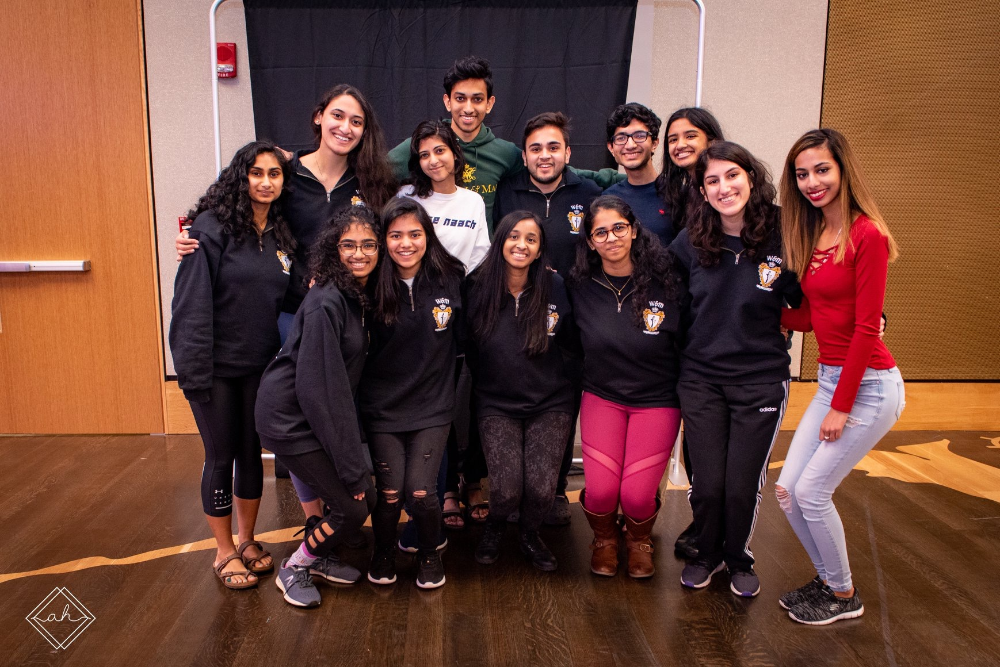
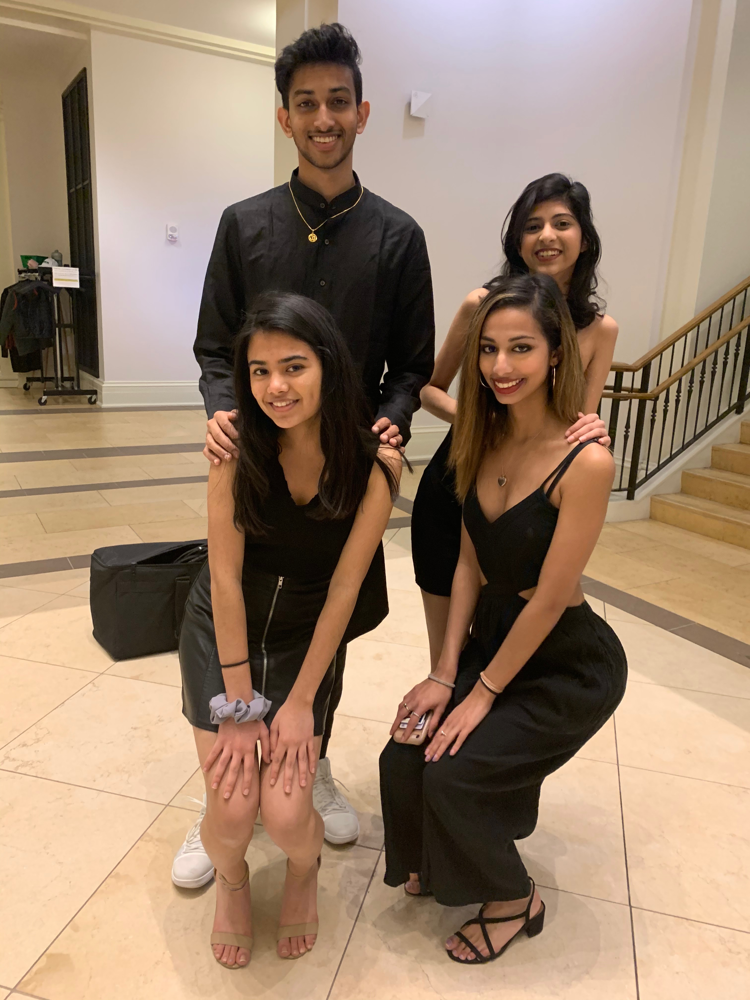
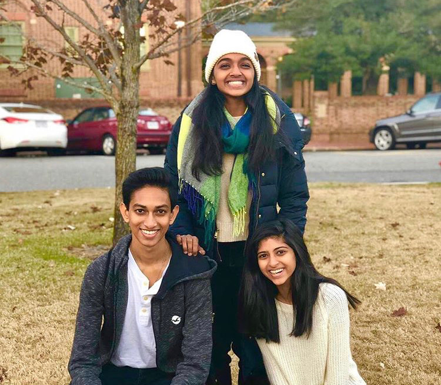

# The Dynasty



Hey there! We are Rohan, Sania, Rini, and Riya. So you must be wondering what this is, who we are and how extra it was to make a website. Well you are right, it is extra af, but this only took us a few minutes so we figured why not haha. Anyways, scroll through to learn more about us and find out why you should befriend our quirky bunch :)


## We put the ILY in FAMILY 💖



We are a fun wholesome bunch of people who love to meet new people, eat amazing food, all things Harry Potter, watch Desi movies, listen to all types of music, and **DANCE**! 


## We love spending time with each other and some of our cool friends 😎



Although sometimes we hate Rohan 🙃, we love to hangout with some of our *amazing* friends (you should also reach out to them)! We like to try different activities, like going on walks to Lake Matoaka, walking to Colonial Williamsburg, having game and movie nights, going to different restaurants near campus, breakout into a random dance sesh, and attending SASA activities (get hyped for Expressions).


## We want to get to know YOU 😊



Yes, you! You are special. This is a crazy time to be alive, and this wild COVID pandemic took over our lives for the past year, but props to you for making this adjustment and making it work. Usually we would have met on campus to try and get to know you guys, have fun parties, go to Busch Gardens, and do other wholesome bonding events, but we can't do all of that right now. However, we also have to make the best of the situation, so we want to reach out to you and hangout! Whether that's on zoom, or in person. Whether you want to meet one of us or all of us. The purpose of this is not for bigs and littles, but just so we can make new friends and spread the joy that we have! 

Reach out and let's hang! 😋

## More about us 🤩


We are very unique people who have diverse backgrounds with lots of different interests, so feel free to scroll through and see if you have anything in common!

### Rohan Boyapati

*rmboyapati@email.wm.edu*

Hey folks, I'm Rohan Boyapati and I'm super pumped to meet you guys. I'm originally from NOVA (classic) and a Junior at W&M, but I'll be graduating in the fall. I'm a Bio major and Data Science minor on the premed track (yes I happened to be one of *those* ppl). I love chocolate, adore slushies 😋, and would die for Biryani. I am also the biggest Psych  🍍 and Office fan! I am a sucker for long walks, no seriously I've walked down to the outlets and back, but usually I'll prob be walking to Matoaka. My favorite spots on/near campus are probably ISC, Matoaka, and WAWA 😩!! I am involved in quite a few different clubs, activities, and research on campus so definitely reach out and we can chat about any of your interests!

### Sania Shahid

*sshahid@email.wm.edu*

Hi guys I'm Sania! I'm a Junior/2022 but graduating in le fall. I have an unhealthy obsession with mini M&Ms and Gilmore Girls is my one-size-fits-all solution to all things in life. I am an international student from Pakistan but also guilty of a little bit of NOVA in me (I went to McLean freshman-junior year of HS). I am an IR major and an Econ minor. On campus I’m involved in Afsana, Debate, the PIPS research lab, and the tour guide program! 

### Rini Gupta

### Riya Garg

## Specifically more about our dynamic dynasty ✨



Rohan and Sania are twins 👯‍♂️. Rohan's little is Riya, Sania's little is Rini. Riya's uncle is Sania, Rini's aunt is Rohan. 

Confused? 

Good. 

That's kinda the point of b/l. Our line has some pretty cool traditions (which sometimes we can just make up on the fly). So potential little(s) if you are reading this, we have tried our best to confuse you and make this weird semester b/l thing work out for you guys.


## Thanks for visiting!


If you scrolled all the way down here and read everything, I'm going to assume you saw the hidden dinosaur image..


just kidding there wasn't a dinosaur image

but seriously reach out to us!

# ✧

*With love,
 The Dynasty*

```[Link](url) and ```

